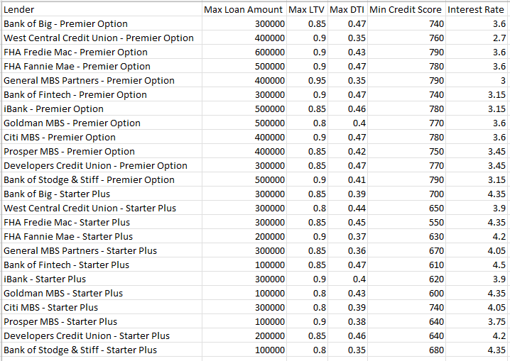
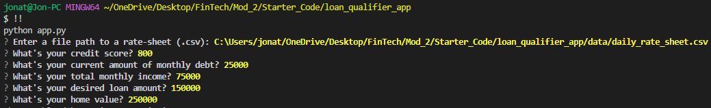

# Loan Qualifier Application

**Welcome to my loan qualifier project. This was created to easily analyze an applicant's credit and financial information to see if their loan fits the criteria for possible acceptance at various banking institutions.**

---

## Technologies
This project has been created with the following technologies:
* Python version: 3.9.12
* Fire
* Questionary
* CSV
* Pathlib

---

## Installation Guide

The loan qualifier is a command line interface (CLI) application. In order to order to run this application, the following must be installed for it to work:

* A command line application such as Git Bash for Windows or Terminal for Mac.

* In your terminal, install Fire using: pip install fire
> pip install fire

* In your terminal, install Questionary using: pip install questionary
> pip install questionary

In this section, you should include detailed installation notes containing code blocks and screenshots.

---

## Usage

To use the loan qualifier application, clone the respository to your local machine and run the app.py file.

Locate the daily_rate_sheet.csv file under the "data" folder. This file contains the list of all the banks available that offer loans and their qualification criterias. Use this data as an example or replace with your own data under each heading.

From there, answer the prompted loan qualification criteria questions.

At the very end, you will be asked if you would like to export your list of filtered banks and their informtation that a user qualifies for. Type "y" for yes if you like to export the data into a new csv file. Or answer "n" for no if you do not want to export a csv file.

---

## Contributors

Loan qualifier application created by: Jonathan Kang (jkang1990amg)

---

## License

No licenses required.